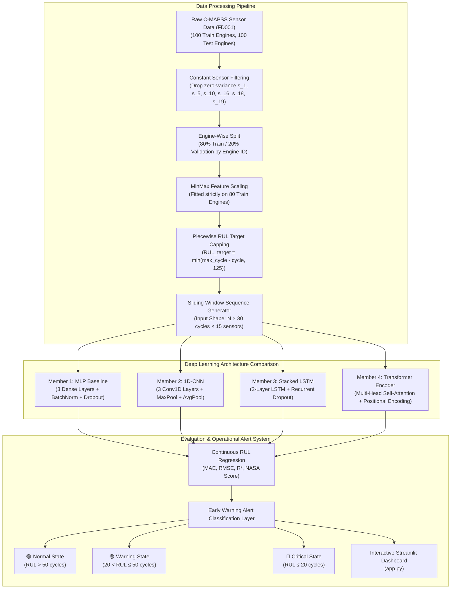

# ⚙️ Comparative Analysis of Deep Learning Architectures for Predictive Maintenance & Remaining Useful Life (RUL) Estimation

[](https://www.python.org/)
[](https://pytorch.org/)
[](LICENSE)
[](app.py)

An end-to-end Deep Learning framework and comparative benchmark for **Predictive Maintenance (PdM)** and **Remaining Useful Life (RUL)** estimation using multivariate time-series sensor data from the **NASA Commercial Modular Aero-Propulsion System Simulation (C-MAPSS FD001)** benchmark.

---

## 📌 Project Overview

Industrial machinery experience progressive physical degradation over time. Unplanned breakdowns cost the global manufacturing industry an estimated **$50 billion annually**. 

This project provides a systematic head-to-head comparison of four architecturally distinct deep learning model families (**MLP**, **1D-CNN**, **LSTM**, and **Transformer Encoder**) trained under a strictly leakage-free experimental protocol. Additionally, continuous RUL predictions are converted into an operational **Early Warning Classification Layer** (*Normal*, *Warning*, *Critical*) for real-world maintenance alert dashboards.

---

## 🔄 End-to-End System Workflow



---

## 👥 Individual Contribution & Model Ownership Matrix

According to course guidelines (**ICT-4442 Deep Learning Mini Project**), each team member owns a distinct model family for independent implementation, tuning, and viva defense:

| Team Member | Role | Assigned Architecture Family | Key Responsibilities & Code Modules |
| :--- | :--- | :--- | :--- |
| **Mayurika Sathish** | Member 1 | **MLP Baseline (Fully-Connected)** | • Feature variance analysis & constant sensor dropping<br>• `src/models/mlp.py` implementation<br>• Dense layer dimension & dropout hyperparameter tuning<br>• Phase 1 Synopsis lead author |
| **Sachith V P** | Member 2 | **1D-CNN (Convolutional Network)** | • Sliding window sequence generator (`src/data_loader.py`)<br>• `src/models/cnn1d.py` Conv1D architecture design<br>• Kernel size & spatial feature map optimization<br>• Exploratory Data Analysis (`notebooks/eda_and_plots.py`) |
| **Ishanvi Kaushik** | Member 3 | **Stacked LSTM (Recurrent/Sequential)** | • Engine-wise train/val split logic (leakage prevention)<br>• `src/models/rnn.py` stacked LSTM implementation<br>• Recurrent dropout & sequence hidden state pooling<br>• Early warning operational alert classification metrics |
| **Rishi Khandelwal** | Member 4 | **Transformer Encoder (Self-Attention)** | • PyTorch Dataset & DataLoader module (`src/dataset.py`)<br>• `src/models/transformer.py` Multi-Head Attention design<br>• Unified trainer (`src/train.py`) & evaluator (`src/evaluate.py`)<br>• Interactive Streamlit dashboard (`app.py`) & Phase 2 report |

---

## 📊 Benchmark Experimental Results (NASA C-MAPSS FD001 Test Set)

All four model architectures were evaluated on identical test trajectories:

| Model Architecture | Owner / Member | Test MAE ↓ | Test RMSE ↓ | Test $R^2$ ↑ | NASA Score ↓ | Early Warning Macro F1 ↑ | Critical State F1 ↑ | Parameter Count | Train Time (s) |
| :--- | :--- | :---: | :---: | :---: | :---: | :---: | :---: | :---: | :---: |
| **MLP Baseline** | Mayurika Sathish | **8.92** | **12.13** | **0.9083** | **267.4** | 0.8604 | 0.8387 | 157,569 | 50.2 s |
| **Stacked LSTM** | Ishanvi Kaushik | 9.60 | 13.24 | 0.8908 | 334.2 | **0.8428** | **0.8667** | 58,241 | 64.4 s |
| **Transformer Encoder** | Rishi Khandelwal | 10.21 | 14.00 | 0.8780 | 412.5 | 0.8150 | 0.8333 | 70,081 | 126.1 s |
| **1D-CNN** | Sachith V P | 14.35 | 18.89 | 0.7778 | 1184.6 | 0.7960 | 0.7407 | **41,153** | 153.7 s |

### 💡 Key Empirical Findings:
1. **Best Operational Reliability**: **LSTM** achieved the highest Critical Failure Alert F1-Score (**0.8667**), demonstrating superior stability for sequential degradation trends without false alarms.
2. **Best Regression Accuracy**: **MLP Baseline** achieved the lowest MAE (**8.92 cycles**) and highest $R^2$ (**0.9083**), fitting flattened tabular windows effectively.
3. **Parameter Efficiency**: **1D-CNN** required only **41,153 parameters** (3.8x fewer parameters than MLP), making it ideal for edge device deployment.

---

## 📁 Repository Directory Structure

```
.
├── data/                       # C-MAPSS dataset text files (train_FD001.txt, test_FD001.txt, etc.)
├── figures/                    # Saved plots & visual figures
│   ├── actual_vs_predicted_comparison.png
│   ├── sensor_degradation_FD001.png
│   └── engine_life_distribution_FD001.png
├── notebooks/                  # Exploratory & visualization scripts
│   ├── eda_and_plots.py
│   └── generate_summary_table.py
├── report/                     # Course academic submission documents
│   ├── Phase1_Synopsis_ICT4442.md
│   ├── Phase2_Interim_ICT4442.md
│   └── GitHub_Collaboration_Guide.md
├── results/                    # Model weights (.pt) and JSON/CSV metrics
│   ├── model_comparison_table.csv
│   └── metrics.json
├── src/                        # Core Python package
│   ├── data_loader.py          # Data ingestion, engine split, MinMax scaling, sequence windowing
│   ├── dataset.py              # PyTorch Dataset wrapper
│   ├── models/                 # Neural network architectures
│   │   ├── mlp.py              # Member 1: Multi-Layer Perceptron
│   │   ├── cnn1d.py            # Member 2: 1D Convolutional Neural Network
│   │   ├── rnn.py              # Member 3: Stacked LSTM / GRU
│   │   └── transformer.py      # Member 4: Transformer Encoder (Self-Attention)
│   ├── train.py                # Unified model training & validation pipeline
│   └── evaluate.py             # Evaluation & Early Warning alert classification
├── app.py                      # Streamlit interactive web dashboard
├── requirements.txt            # Dependencies
└── run_all_experiments.py      # Master benchmark execution script
```

---

## 🚀 Quickstart & How to Run

### 1. Environment Setup
```bash
# Clone the repository
git clone https://github.com/YOUR_USERNAME/predictive-maintenance-cmapss.git
cd predictive-maintenance-cmapss

# Install dependencies
pip install -r requirements.txt
```

### 2. Run Complete Architecture Benchmark
To train all 4 models and generate comparative metrics:
```bash
python run_all_experiments.py
```

### 3. Train & Evaluate an Individual Model
```bash
# Train LSTM model
python -m src.train --model lstm --epochs 25

# Evaluate Early Warning Alert states
python -m src.evaluate lstm
```

### 4. Launch Interactive Streamlit Dashboard
```bash
streamlit run app.py
```

---

## 📄 Academic Deliverables & Course Submissions

* **Phase 1 Synopsis Report**: [report/Phase1_Synopsis_ICT4442.md](report/Phase1_Synopsis_ICT4442.md)
* **Phase 2 Interim Report**: [report/Phase2_Interim_ICT4442.md](report/Phase2_Interim_ICT4442.md)
* **GitHub Team Collaboration Guide**: [report/GitHub_Collaboration_Guide.md](report/GitHub_Collaboration_Guide.md)
